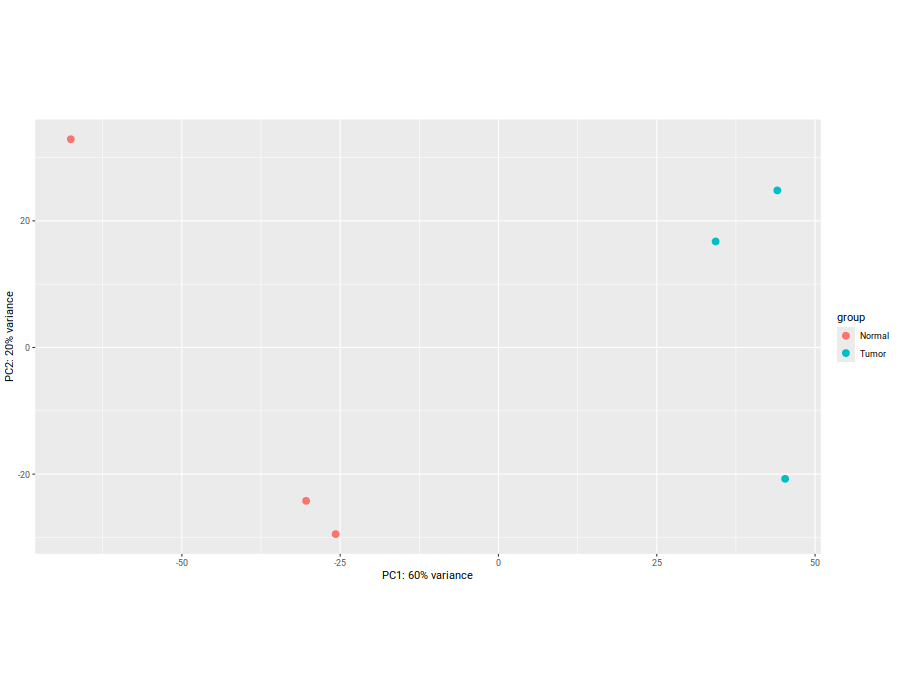
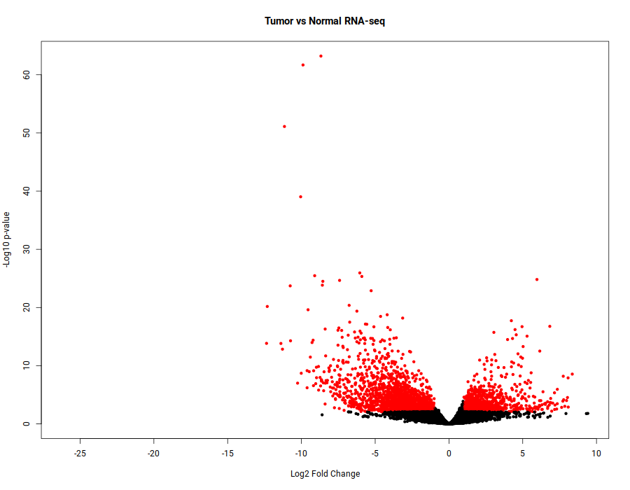

# 🧬 RNA-seq Differential Expression Analysis in Colorectal Cancer

## 📌 Overview
This project implements an end-to-end RNA-seq analysis pipeline to identify differentially expressed genes between tumor and normal colorectal cancer samples.

The workflow includes:
- FASTQ download (SRA)
- Alignment using STAR
- Gene quantification using featureCounts
- Differential expression analysis using DESeq2
- Visualization (PCA, volcano plot)

---

## ⚙️ Pipeline Overview

FASTQ → STAR alignment → BAM → featureCounts → count matrix → DESeq2 → results

---

## 📊 Key Results

### 🔬 Top Upregulated Genes (Tumor)
- ETV4
- LGR5
- FOXQ1
- CEMIP

### 🔻 Top Downregulated Genes (Tumor)
- SCNN1B
- MS4A12
- CLCA4
- SFRP1

---

## 📈 PCA Plot


---

## 🌋 Volcano Plot


---

## 🧪 Methods

### Alignment
- Tool: STAR
- Reference: GENCODE v26

### Quantification
- Tool: featureCounts
- Feature type: exon → gene-level aggregation

### Differential Expression
- Tool: DESeq2
- Design: ~ condition (Tumor vs Normal)
- Significance thresholds:
  - adjusted p-value < 0.05
  - |log2FoldChange| > 1

---

## 📁 Project Structure

```text
rnaseq-crc-analysis/
├── scripts/
│   ├── 01_download_fastq.sh
│   ├── 02_star_align.sh
│   └── 03_featurecounts.sh
├── analysis/
│   └── 01_deseq2_analysis.R
└── results/
    ├── deseq2_results_annotated.csv
    ├── pca_plot.png
    ├── volcano_plot.png
    ├── top_upregulated_genes.csv
    └── top_downregulated_genes.csv
```

---

## 🚀 How to Run

### 1. Download FASTQ files
```bash
bash scripts/01_download_fastq.sh
```

### 2. Align reads with STAR
```bash
bash scripts/02_star_align.sh
```

### 3. Generate gene counts
```bash
bash scripts/03_featurecounts.sh
```

### 4. Run differential expression (DESeq2)
```r
source("analysis/01_deseq2_analysis.R")
```

---

## 💡 Skills Demonstrated

- RNA-seq pipeline development
- Linux & Bash scripting
- High-throughput alignment (STAR)
- Read quantification (featureCounts)
- Statistical modeling (DESeq2)
- Data visualization (PCA, volcano plots)

---

## 📌 Notes

- Raw FASTQ and BAM files are not included due to size constraints
- All results are reproducible using the provided scripts
